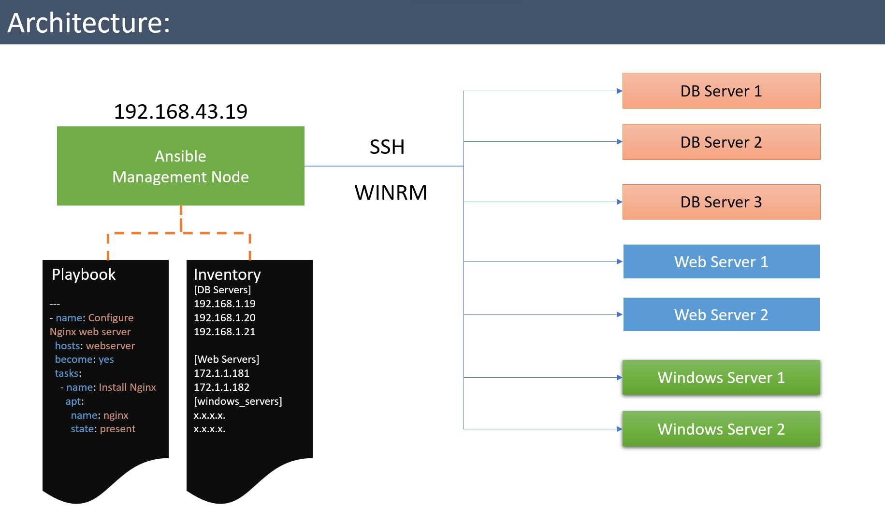

# What is Ansible?
Ansible is an **IT automation tool**. It can configure systems, deploy software, and orchestrate more advanced IT tasks such as continuous deployments or zero downtime rolling updates.

> [!NOTE]
> You cannot install Ansible on Windows Server, however you can manage Windows Servers through Ansible.

# Key Features

### Agentless Architecture
Ansible is agentless, meaning it doesn't require any software or agents to be installed on the target hosts. This simplifies the deployment and management of systems, as there's no need to maintain agents on every managed node.

### SSH and WinRM Support
Ansible uses SSH for managing Unix-like operating systems and WinRM for managing Windows systems. This makes it highly versatile and compatible with a wide range of systems.

### Declarative Language
Ansible uses a declarative language in the form of YAML playbooks to describe the desired state of the system. This makes it easy to read and understand, even for those who are not expert programmers.

### Idempotency
Ansible playbooks are idempotent, which means running a playbook multiple times has the same effect as running it once. This ensures that the system remains in the desired state and doesn't perform unnecessary actions.

### Modular and Extensible
Ansible is highly modular and extensible. Users can create custom modules and roles to automate specific tasks and share them with the Ansible community through Ansible Galaxy.

### Orchestration
Ansible can manage multi-tier applications and complex infrastructures. It provides powerful orchestration capabilities to coordinate tasks across different hosts and ensure they execute in the correct order.

### Inventory Management
Ansible uses inventory files to define target hosts and organize them into groups. This allows for precise control over which hosts are affected by specific tasks or playbooks.

### Security
Ansible takes security seriously, with built-in features for securely storing and managing sensitive data, such as passwords and secret keys, using tools like Ansible Vault.

### Community and Ecosystem
Ansible has a large and active user community, making it easy to find support, share playbooks, and learn from others. The Ansible Galaxy provides a repository of pre-built roles for common tasks.

### Cost-Efficient
As an open-source tool, Ansible is cost-effective, saving organizations from investing in expensive automation solutions. It's also platform-agnostic, so there's no need for specialized software for different operating systems.

### Continuous Integration/Continuous Deployment (CI/CD) Integration
Ansible integrates seamlessly with CI/CD pipelines, allowing automation of deployment and testing processes. It helps in achieving DevOps goals by automating and accelerating software delivery.

### Configuration Drift Detection
Ansible can detect and report configuration drift, helping to ensure that systems remain compliant with the desired configurations. Ansible keeps a record of the last known state of each managed system based on the playbook execution. This known state acts as a reference point. When Ansible runs a playbook again, it detects any discrepancies between the current system state and the reference state.

# Architecture

